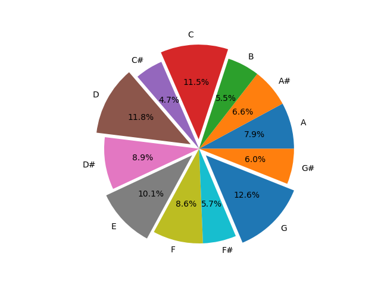

# 歌曲调位总结

## 当前进度

对应知乎专栏文章：[有关歌曲调号的分布的简单统计与分析](https://zhuanlan.zhihu.com/p/56102065)

```plain
┏━━━━━━━┳━━━━━━━━━━━━━━━━┳━━━━━━━━━━━━━━━━━┳━━━━━━━━━━━━━━━━━┳━━━━━━━━━━━━━━━━━┓
┃ Key   ┃ Total(percent) ┃         Chinese ┃         Foreign ┃    Instrumental ┃
┡━━━━━━━╇━━━━━━━━━━━━━━━━╇━━━━━━━━━━━━━━━━━╇━━━━━━━━━━━━━━━━━╇━━━━━━━━━━━━━━━━━┩
│ A     │    90 ( 7.87%) │     53 ( 8.44%) │     29 ( 4.62%) │      8 ( 1.27%) │
│ A#    │    74 ( 6.47%) │     38 ( 6.05%) │     22 ( 3.50%) │     14 ( 2.23%) │
│ B     │    61 ( 5.34%) │     32 ( 5.10%) │     22 ( 3.50%) │      7 ( 1.11%) │
│ C     │   137 (11.99%) │     64 (10.19%) │     34 ( 5.41%) │     39 ( 6.21%) │  
│ C#    │    55 ( 4.81%) │     34 ( 5.41%) │     11 ( 1.75%) │     10 ( 1.59%) │  
│ D     │   139 (12.16%) │     71 (11.31%) │     55 ( 8.76%) │     13 ( 2.07%) │  
│ D#    │   103 ( 9.01%) │     61 ( 9.71%) │     31 ( 4.94%) │     11 ( 1.75%) │  
│ E     │   111 ( 9.71%) │     60 ( 9.55%) │     43 ( 6.85%) │      8 ( 1.27%) │  
│ F     │    97 ( 8.49%) │     57 ( 9.08%) │     25 ( 3.98%) │     15 ( 2.39%) │  
│ F#    │    64 ( 5.60%) │     33 ( 5.25%) │     26 ( 4.14%) │      5 ( 0.80%) │  
│ G     │   145 (12.69%) │     90 (14.33%) │     27 ( 4.30%) │     28 ( 4.46%) │  
│ G#    │    67 ( 5.86%) │     35 ( 5.57%) │     25 ( 3.98%) │      7 ( 1.11%) │  
├───────┼────────────────┼─────────────────┼─────────────────┼─────────────────┤  
│ Total │           1143 │             628 │             350 │             165 │  
└───────┴────────────────┴─────────────────┴─────────────────┴─────────────────┘
```



## 脚本使用方法

从 2021 年 11 月 9 日开始，不再使用 Markdown 文档记录歌曲，而是全部记录在 sqlite 数据库文件（`songs.db`）中。推荐使用 [SQLite Browser](https://github.com/sqlitebrowser/sqlitebrowser) 对 `songs.db` 文件进行查看。

可以运行 `visualize.py` 进行数据的进一步分析，包括生成表格以及扇形图。

```shell
python visualize.py
```

如果想要查看以前的 Markdown 文件，除了可以在 commit 历史中找到，还可以运行 `sql2md.py` 来生成 Markdown 文档。

```shell
python sql2md.py
```

## 规则

* 按照国语歌曲、外语歌曲、纯音乐的顺序进行排序
* 按照歌曲主歌部分（而非前奏部分）的调号进行归纳
* 同一类别下按照英文名、中文名、日文名、其他（如数字、法语、韩语）的顺序进行排列
* 歌曲后面的备注分别为：（《出处》，歌手1[&歌手2]，“歌词”）『注音』【转调】
